# Subject

전기차 캐즘 시기 LGES와 CATL의 전략적 회복탄력성 비교 분석 AI 에이전트 시스템

본 프로젝트는 LG에너지솔루션(LGES)과 CATL을 대상으로 시장 환경, 기업 포트폴리오, SWOT 요인, 회복탄력성, 전략적 시사점을 다단계 AI 에이전트 파이프라인으로 비교 분석하는 시스템입니다. 자료 수집부터 정제, 분석, 보고서 작성까지의 흐름을 자동화하며, 분석 단계에서는 결과 구조와 근거를 점검하는 검증 절차를 포함합니다.

## Overview

- Objective : 전기차 수요 둔화와 경쟁 심화가 동시에 발생하는 캐즘 구간에서 LGES와 CATL의 경쟁 우위, 취약 요인, 기회, 위협, 그리고 전략적 회복탄력성을 구조적으로 비교 분석하고, 이를 기업별 분석과 양사 비교 분석에 직접 활용 가능한 보고서 형태로 정리합니다.
- Method : `Research → Refine → Analysis → Report` 파이프라인을 기반으로 자료 조사, 사실 정제, SWOT 분류, LLM 기반 비교 분석, 교차 검증, 보고서 병합 및 문서 출력을 순차 수행합니다. 조사 단계에서는 외부 자료와 내부 문서를 함께 사용하고, 분석 단계에서는 입력 fact를 유지한 상태에서 비교 해석을 수행합니다.
- Tools : OpenAI API, Chroma VectorDB, Tavily Web Search

## Features

- PDF 자료, 기업 보고서, 웹 기사, 벡터DB 문서를 함께 활용한 멀티소스 정보 수집
- 기업별 핵심 사실 정제 후 S/W/O/T 카테고리 자동 매핑
- SWOT 4축 병렬 분석과 통합 비교 SWOT 매트릭스 생성
- EV 캐즘 구간 기준 회복탄력성 평가 및 전략적 인사이트 도출
- Markdown/PDF 보고서 자동 생성 및 `report/final`, `docs` 동시 저장
- Refine 단계와 Analysis 단계 사이에서 SWOT 항목을 canonical schema로 정규화
- Analysis 단계에서 SWOT 응답 구조와 필수 항목을 검증
- 확증 편향 방지 전략 : Web 검색과 VectorDB 검색을 병행하고, `cross_validation_node`에서 `raw_findings`와 최종 인사이트를 다시 대조하여 근거가 약한 주장, 누락된 축, 과도한 일반화를 검증합니다.
- 보고서 섹션별 평가 기준 반영 : 시장 배경, 기업 분석, 핵심 전략 비교, 종합 시사점, SUMMARY에 대해 정량 근거와 체크 항목을 확인
- 양사 모두 S/W/O/T 4개 버킷을 포함하도록 입력 fact와 후속 검증 로직을 함께 사용

## Tech Stack

| 구분       | 세부 내용                          |
| ---------- | ---------------------------------- |
| 프레임워크 | LangGraph, LangChain, Python       |
| LLM        | OpenAI API 기반 GPT-4o-mini        |
| 검색       | Chroma VectorDB, Tavily Web Search |
| 임베딩     | BAAI/bge-m3                        |
| 출력 형식  | Markdown, PDF                      |
| 상태 관리  | TypedDict 기반 GraphState          |

## Agents

- Agent of 조사: SWOT 및 시장 관점의 검색 쿼리를 생성하고, Web/VectorDB 검색 경로를 분기하여 LGES와 CATL 비교에 필요한 근거 문서를 수집합니다.
- Agent of 자료 정리: `raw_findings`를 기업별 핵심 사실로 정리하고, 시장 컨텍스트와 기업 포트폴리오를 구조화하며, 사실을 S/W/O/T 버킷에 분류합니다.
- Agent of 분석: SWOT 4개 축을 병렬 분석하고 통합 SWOT 매트릭스를 생성한 뒤, 회복탄력성 평가와 전략적 인사이트를 도출합니다. 이 단계는 구조 검증, 입력 fact 유지, cross-validation 로직을 포함합니다.
- Agent of 보고서 작성: 분석 결과를 섹션별 보고서 초안으로 작성하고, SUMMARY, 비교 SWOT, 전략 제언, 레퍼런스까지 포함한 최종 Markdown/PDF 결과물로 병합 및 저장합니다.

## Architecture



위 다이어그램은 자료 조사 단계의 전체 흐름을 중심으로 정리한 아키텍처입니다. 전체 시스템은 `Research → Refine → Analysis → Report` 4단계로 연결되며, Research 단계에서 수집된 근거가 이후 정제, 분석, 보고서 작성 단계의 입력으로 사용됩니다.

실제 구현 파이프라인은 아래와 같습니다.

```text
Research
  -> query_generation
  -> strategy_routing
  -> vectordb_retrieval / web_retrieval
  -> evidence_validation
  -> coverage_check
  -> build_output

Refine
  -> clean_node
  -> market_node
  -> portfolio_node
  -> swot_map_node

Analysis
  -> strength / weakness / opportunity / threat (병렬 실행)
  -> context_integration
  -> resilience_evaluation
  -> insight
  -> cross_validation
  -> human_review 또는 dispatch

Report
  -> section generation
  -> merge
  -> markdown/pdf export
```

아키텍처 특징은 다음과 같습니다.

- Research 단계는 쿼리별 검색 전략을 분기하여 웹 검색과 벡터 검색을 함께 수행합니다.
- Refine 단계는 분석 이전에 fact를 정리하고 SWOT, 포트폴리오, 시장 문맥으로 구조화합니다.
- Analysis 단계는 병렬 SWOT 분석 후 fan-in 구조로 통합 평가를 수행합니다.
- Report 단계는 분석 결과를 사람이 읽을 수 있는 서술형 문서로 재구성합니다.
- Coverage Check는 양사 비교에 필요한 정보가 충분한지 판단하고, 부족한 경우 재검색 루프로 되돌아갑니다.
- 보고서 출력은 시장 배경, LGES 분석, CATL 분석, Comparative SWOT, 종합 시사점, SUMMARY, REFERENCE 순으로 구성합니다.
- 평가 기준 예시는 다음을 포함합니다.
  시장 배경: 캐즘 원인, OEM 대응, 정책/규제, 정량 근거
  LGES 분석: 북미 JV, 신사업 카테고리, 포트폴리오 구성, 생태계 확장
  CATL 분석: 차세대 배터리 전략, ESS 확장, 비즈니스 모델, 공급망 구조
  Comparative SWOT: 기술 지표 비교, 경제 지표 비교, SWOT 완결성, 전략적 시사점
  종합 시사점: 핵심 승부처, 국내 산업 제언, 2026년 이후 전망

실행 예시는 다음과 같습니다.

- 분석만 실행 : `uv run python -m src.run`
- 보고서까지 전체 실행 : `uv run python -m src.run --report`
- 상세 로그 포함 실행 : `uv run python -m src.run --report -v`

환경 변수:

- `OPENAI_API_KEY` : Research, Refine, Analysis, Report 전 구간 LLM 호출에 사용
- `TAVILY_API_KEY` : Web 검색 경로 사용 시 필요

## Directory Structure

```text
lges-vs-catl-analysis/
├── data/                  # 원본 데이터, 중간 산출물, Chroma VectorDB 저장소
│   ├── raw/               # findings.json, 원본 수집 결과
│   ├── processed/         # 정제/중간 결과 저장 공간
│   └── vectordb/          # 문서 임베딩 기반 로컬 벡터 저장소
├── src/                   # 전체 파이프라인 소스 코드
│   ├── agents/            # 프롬프트, 그래프 orchestration, 상위 실행 로직
│   ├── core/              # 환경 변수, LLM/VectorDB 초기화, 공통 설정
│   ├── nodes/             # Research / Refine / Analysis / Report 단계별 노드 함수
│   ├── state/             # GraphState, TypedDict, 공통 상태 정의
│   └── tools/             # 검색, 임베딩, 토큰 관리, 유틸리티 도구
├── report/                # 섹션 초안 및 최종 보고서 저장
│   ├── sections/          # 병렬 생성된 보고서 섹션 초안
│   └── final/             # 최종 Markdown/PDF 결과물
├── docs/                  # 설계 문서 및 산출물 보관
├── tests/                 # 단위 테스트 및 end-to-end 테스트
└── README.md
```

주요 산출물은 다음과 같습니다.

- `report/final/` : 최종 Markdown/PDF 보고서

## Contributors

- 한상윤 : Research Engineer. Query Generation, VectorDB Retrieval, Web Retrieval, Validate Evidence, Coverage Check 노드와 자료 조사 파이프라인 담당
- 김주환 : Data Processing Engineer. `clean_node`, `market_node`, `portfolio_node`, `swot_map_node` 및 자료 정리/구조화 로직 담당
- 방다원 : Analysis AI Engineer. S/W/O/T 병렬 분석 노드, `resilience_evaluation_node`, `insight_node` 및 비교 분석 프롬프트 설계 담당
- 지다은 : Architect & Report Engineer. GraphState 설계, 전체 노드 연결, 보고서 섹션 생성 노드, `merge_node` 및 최종 산출물 생성 담당
