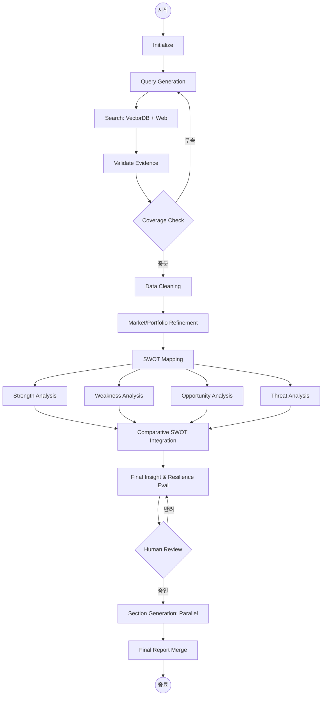

# 설계 산출물

#### 김주환, 방다원, 지다은, 한상윤

---

## Workflow

### Goal

**전기차 시장 정체기 상황에서 LGES와 CATL의 전략적 회복탄력성을 설명할 수 있는 객관적 근거를 확보하고, 이를 기업별 및 비교 관점에서 구조화하여 SWOT 분석에 직접 활용 가능한 형태로 보고서를 산출한다.**

### Criteria

| 섹션 | 평가 기준 | 세부 체크 항목 |
| --- | --- | --- |
| 시장 배경 | 캐즘 원인 제시 | 캐즘 원인이 3가지 이상 명시되었는가 (고금리, 보조금 축소, 충전 인프라 등) |
|  | OEM 대응 사례 | OEM 대응 사례가 최소 1개 이상 포함되었는가 |
|  | 정책/규제 반영 | 공급망 규제(IRA, CRMA) 내용이 포함되었는가 |
|  | 정량 근거 | 수치 또는 데이터가 최소 1개 이상 포함되었는가 |
| LGES 기업 분석 | 북미 JV 현황 | 북미 JV 현황이 포함되었는가 |
|  | 신사업 카테고리 | Physical AI 카테고리가 명시되었는가 |
|  | 포트폴리오 구성 | 포트폴리오 항목이 3개 이상 제시되었는가 |
|  | 생태계 확장 | BaaS 또는 재활용 생태계 언급이 포함되었는가 |
| CATL 분석 | 차세대 배터리 전략 | 나트륨이온 배터리 전략이 포함되었는가 |
|  | ESS 확장 전략 | ESS 신흥시장 전략이 포함되었는가 |
|  | 비즈니스 모델 | LRS 모델 설명이 포함되었는가 |
|  | 공급망 구조 | 수직 계열화 내용이 포함되었는가 |
| 핵심 전략 비교 및 SWOT 분석 | 기술 지표 비교 | 기술 지표 비교가 포함되었는가 (에너지밀도, 충전속도, 사이클 등) |
|  | 경제 지표 비교 | 경제 지표 비교가 포함되었는가 (원가, 점유율, 수주잔고 등) |
|  | SWOT 완결성 | S/W/O/T 4개 버킷이 양사 모두 채워졌는가 |
|  | 시사점 제시 | 전략적 시사점 컬럼이 포함되었는가 |
| 종합 시사점 및 제언 | 핵심 승부처 도출 | 캐즘 이후 핵심 승부처가 명시되었는가 |
|  | 국내 산업 제언 | 국내 산업에 대한 제언이 포함되었는가 |
|  | 중장기 전망 | 2026년 이후 전망이 포함되었는가 |
| SUMMARY | 핵심 전략 요약 | 양사 핵심 전략이 각각 한 줄로 요약되었는가 |
|  | 결론 명확성 | 결론 메시지가 명확한가 |
|  | 전체 반영성 | 전체 보고서 내용을 반영하고 있는가 |

### Task & Node

**Task.1 자료 조사**

```python
[Initialize]            # 기업명, 분석 목적 State에 주입
        ↓
[Query Generation]      # SWOT 축별 조사 질문 생성
        ↓
[Strategy Routing]      # 질문별 VectorDB vs Web 검색 전략 결정
       ↙ ↘
[VectorDB Retrieval]  [Web Retrieval]   # 병렬 검색
       ↘ ↙
[Company Research]      # 기업별 조사 (A/B 병렬)
        ↓
[Comparative Research]  # 두 기업 비교 조사
        ↓
[Merge Results]         # 조사 결과 통합
        ↓
[Validate Evidence]     # 출처 확인, 증거 검증
        ↓
[SWOT Tagging]          # 항목별 S/W/O/T 태깅
        ↓
[Coverage Check]        # 충분성 판단, 미달 시 → Company Research로 back
        ↓
[Build Output]          # State 결과 생성
        ↓
[Human Review]          # 검토, pass/fail
        ↓
[Deliver]               # 정제 에이전트로 State 전달
```

**Task.2 자료 정리**

```python
[조사 에이전트들]
        ↓
[clean_node] # 중복 항목 제거, LLM 사용
        ↓
[market_node] # 시장/산업 관련 내용에서 전체시장 + 두 기업과 관련된 시장 내용으로 정리
        ↓
[portfolio_node] # 각 기업의 핵심 서비스/제품 목록화, 포트폴리오 다각화 전략 전략으로 정리
        ↓
[swot_map_node] # cleaned 데이터를 S/W/O/T 카테고리에 맞는 정보들만 몰아서 준다. 분석은 안함.
        ↓
[분석/비교 에이전트]
```

**Task.3 자료 분석**

```python
[context_integration_node]   # 전체 output을 하나의 분석용 Context로 통합
        ↓
[resilience_evaluation_node] # EV 시장 정체기 하위 포트폴리오 다각화 방어력 평가
        ↓
[insight_node]               # LGES vs CATL 최종 전략적 시사점(Insight) 도출
        ↓
[cross_validation_node]      # 이전 단계 수치/증거와 상충되지 않는지 교차 검증
        ↓
[human_review_node]          # (선택적) 핵심 시사점의 품질 및 논리 검토
        ↓
[dispatch_node]              # 보고서 작성용 최종 패킷 생성 및 전달
```

**Task.4 보고서 작성**

```python
[section1_node] ── [section2_node] ── [section3_node]   # 병렬 처리
        ↓                  ↓                  ↓
        └──────────────────┴──────────────────┘
                           ↓
              [section4_node]                       # 비교 분석 + SWOT 테이블
                           ↓
              [section5_node]                       # 종합 시사점
                           ↓
              [section0_node]                   # 요약 (SUMMARY 핵심 메시지 3줄)
                           ↓
              [section6_node]                        # 레퍼런스
                           ↓
              [merge_node]                           # 최종 보고서 합치기
```

### **에이전트 워크플로우**


# Agent

### RAG 적용 대상 및 Embedding 모델 설계

### RAG 적용 대상 선정

| 구분 | 적용 여부 | 적용 이유 | 데이터 특성 | 예시 |
| --- | --- | --- | --- | --- |
| 기업 분석 | 적용 | 최신 전략, 투자, IR 정보 필요 | 시계열 변화, 기업별 상이 | 북미 투자, JV, 고객사 |
| 시장 분석 | 적용 | 외부 통계 및 산업 데이터 필요 | 정량 데이터 (TAM, CAGR 등) | EV 시장 성장률 |
| 정책/규제 | 적용 | 최신 정책 변화 반영 필수 | 시점 의존성 높음 | IRA, CRMA |
| 기술/제품 | 적용 | 전문 기술 정보 필요 | 용어 다양, 빠른 변화 | LFP, 전고체 배터리 |
| SWOT 분석 | 미적용 | 이미 수집된 데이터 기반 분석 | reasoning 중심 | S/W/O/T 분류 |
| 종합 시사점 | 미적용 | 전략적 해석 단계 | 추론 중심 | 전략 방향 도출 |

### Embedding 모델 선정

| 항목 | 내용 |
| --- | --- |
| 모델명 | BGE-M3 (BAAI General Embedding Model) |
| 유형 | 오픈소스 다국어 embedding 모델 |
| 적용 목적 | VectorDB 기반 semantic retrieval |
| 지원 언어 | 한국어, 영어 |
| 주요 특징 | 의미 기반 검색, 긴 문서 처리, 범용성 |

BGE-M3를 선택한 이유는 다음과 같다.

- 다국어 지원 (Korean + English)
LGES는 한국 기업, CATL은 중국 기업이며, 관련 자료는 한국어와 영어로 혼합되어 존재한다. 따라서 다국어 embedding 성능이 필수적이다.
- Semantic Retrieval 성능
본 시스템은 단순 키워드 검색이 아니라 “의미 기반 검색”이 필요하다. 예를 들어 “IRA 수혜”와 “북미 생산 전략”은 표현은 다르지만 의미적으로 연결된다. BGE-M3는 이러한 semantic similarity를 효과적으로 반영한다.
- 긴 문서 처리 능력
산업 보고서, IR 자료, 정책 문서는 길이가 길기 때문에 chunk 단위로 분할하여 embedding해야 한다. BGE-M3는 긴 문서에서도 안정적인 embedding 품질을 유지한다.
- 범용성 및 안정성
특정 도메인에 과적합되지 않고 다양한 텍스트에서 일관된 성능을 제공하기 때문에 기업/시장/정책 데이터를 함께 처리하는 본 시스템에 적합하다.

---

### Embedding 및 Retrieval 설계

| 구성 요소 | 설명 | 목적 |
| --- | --- | --- |
| Chunking | 문서를 문단 단위로 분할 | 검색 정확도 향상 |
| Metadata | 기업, 날짜, 출처, 유형 저장 | 필터링 및 정렬 |
| Embedding | BGE-M3로 벡터 변환 | 의미 기반 검색 |
| Similarity | cosine similarity 사용 | 유사 문서 탐색 |
| Retrieval | Top-K 검색 + reranking | 핵심 정보 선택 |

---

## 1. State 설계

각 노드는 이 `State`를 읽고 수정하며 최종 보고서까지 데이터를 전달한다.

### 1.1. State 정의: Sub-State → 통합 GraphState

```python
# ================================================================
# Shared Types
# ================================================================

class RawItem(TypedDict):
    content: str
    category: str              # strengths / weaknesses / opportunities / threats / market

class SWOTItem(TypedDict):
    content: str
    source: str
    is_fact: bool

class CompanySWOT(TypedDict):
    S: List[SWOTItem]
    W: List[SWOTItem]
    O: List[SWOTItem]
    T: List[SWOTItem]

class PortfolioItem(TypedDict):
    core_services: List[str]
    revenue_contribution: Dict             # {"서비스명": "62%"}
    diversification_type: str             # 수직 / 수평 / 비관련
    diversification_stage: str            # 투자 / 수익화
    core_competency: str

class MarketContext(TypedDict):
    TAM: Optional[str]
    SAM: Optional[str]
    CAGR: Optional[str]
    trend: Optional[str]
    company_a_position: Optional[str]
    company_b_position: Optional[str]

class CompanyRaw(TypedDict):
    name: str
    items: List[RawItem]

# ================================================================
# Research Finding (raw 데이터 보존)
# ================================================================

class ResearchFinding(TypedDict):
    agent_name: str            # 수집 에이전트 (LGES_Search, CATL_Search 등)
    source_type: str           # "web_search" | "vector_db"
    subtopic: str              # 담당 세부 주제 (LFP 기술, IRA 대응 등)
    raw_content: str           # 원문 데이터 (최소 800자 이상, 절대 압축 금지)
    key_points: List[str]      # 에이전트 간 통신용 핵심 요약 (3~5개)
    sources: List[str]         # 출처 리스트

# ================================================================
# Control & Management
# ================================================================

class ControlState(TypedDict, total=False):
    retry_count: int
    max_retry: int
    human_review_flags: List[str]
    warnings: List[str]

# ================================================================
# 조사 에이전트
# ================================================================

class QueryState(TypedDict, total=False):
    query_set: List[str]
    search_plan: List[str]

class RetrievalState(TypedDict, total=False):
    raw_documents: List[Dict]
    grouped_documents: Dict[str, List[Dict]]   # by query_id

class EvidenceState(TypedDict, total=False):
    validated_evidence: List[Dict]
    rejected_evidence: List[Dict]

class CriteriaState(TypedDict, total=False):
    coverage_status: str
    missing_topics: List[str]
    evidence_quality_flags: List[str]
    comparability_flags: List[str]

class OutputState(TypedDict, total=False):
    summary: str
    key_findings: List[str]
    validated_evidence_ids: List[str]
    comparison_item_ids: List[str]
    swot_candidate_ids: List[str]
    unresolved_gaps: List[str]

class ResearchGraphState(TypedDict, total=False):
    # 불변 입력
    goal: str
    target_companies: List[str]
    report_topic: str
    subtopics: List[str]           # Coordinator가 생성한 세부 조사 항목
    current_subtopic: str          # Send()로 개별 에이전트에 전달될 현재 주제
    # 노드별 작업
    query: QueryState
    retrieval: RetrievalState
    evidence: EvidenceState
    criteria: CriteriaState
    company_a: CompanyRaw
    company_b: CompanyRaw
    # raw 데이터 보존 (절대 압축 금지, operator.add로 누적)
    raw_findings: Annotated[List[ResearchFinding], operator.add]
    completed_agents: Annotated[List[str], operator.add]
    # 메타
    control: ControlState
    output: OutputState

# ================================================================
# 정리 에이전트
# ================================================================

class CleanState(TypedDict, total=False):
    company_a_cleaned: List[RawItem]
    company_b_cleaned: List[RawItem]

class RefineOutputState(TypedDict, total=False):
    market_context: MarketContext
    company_a_portfolio: PortfolioItem
    company_b_portfolio: PortfolioItem
    company_a_swot: CompanySWOT
    company_b_swot: CompanySWOT

class DataRefineGraphState(TypedDict, total=False):
    # 조사 에이전트로부터
    company_a: CompanyRaw
    company_b: CompanyRaw
    # raw 데이터 그대로 유지 (압축 금지)
    raw_findings: Annotated[List[ResearchFinding], operator.add]
    # 노드별 작업
    clean: CleanState
    refine_output: RefineOutputState
    # 메타
    control: ControlState

# ================================================================
# 분석 에이전트
# ================================================================

class CategoryAnalysisState(TypedDict, total=False):
    lges_items: List[Dict]
    catl_items: List[Dict]
    comparative_points: List[Dict]
    strategic_implications: List[str]

class SwotAnalysisState(TypedDict, total=False):
    S: CategoryAnalysisState
    W: CategoryAnalysisState
    O: CategoryAnalysisState
    T: CategoryAnalysisState

class ComparativeSwotState(TypedDict, total=False):
    S: Dict
    W: Dict
    O: Dict
    T: Dict
    consistency_flags: List[str]

class InsightState(TypedDict, total=False):
    key_differences: List[str]
    resilience_evaluation: Dict
    strategic_winner: str
    final_insights: List[str]

class AnalysisGraphState(TypedDict, total=False):
    # 정리 에이전트로부터
    market_context: MarketContext
    company_a_portfolio: PortfolioItem
    company_b_portfolio: PortfolioItem
    company_a_swot: CompanySWOT
    company_b_swot: CompanySWOT
    # raw 데이터 교차 검증용으로 유지
    raw_findings: Annotated[List[ResearchFinding], operator.add]
    # 노드별 작업
    swot_analysis: SwotAnalysisState
    comparative_swot: ComparativeSwotState
    # 최종
    final_insight: InsightState
    # 메타
    control: ControlState

# ================================================================
# 보고서 에이전트
# ================================================================

class ReportSectionState(TypedDict, total=False):
    section0: str    # 요약
    section1: str    # 시장 배경
    section2: str    # LGES 분석
    section3: str    # CATL 분석
    section4: str    # 비교 분석 + SWOT
    section5: str    # 종합 시사점
    section6: str    # 레퍼런스

class ReportGraphState(TypedDict, total=False):
    # 분석 에이전트로부터
    market_context: MarketContext
    comparative_swot: ComparativeSwotState
    final_insight: InsightState
    company_a_portfolio: PortfolioItem
    company_b_portfolio: PortfolioItem
    # raw 데이터 레퍼런스 생성용으로 유지
    raw_findings: Annotated[List[ResearchFinding], operator.add]
    # 노드별 작업
    sections: Annotated[ReportSectionState, operator.itemgetter]
    # 최종
    final_report: str
    # 메타
    control: ControlState
```

### 1.2 State 주요 특징

- **raw_findings의 누적**: `operator.add`를 통해 모든 조사 에이전트가 수집한 데이터를 소실 없이 통합한다.
- **이중 구조 데이터**: 통신용 `key_points`와 작성용 `raw_content`를 분리하여 보고서 작성 시 풍부한 데이터가 활용되도록 강제한다.

### 1.3. 주요 State 항목 상세 설명

| **항목** | **타입** | **설명** |
| --- | --- | --- |
| `validated_evidence` | `List[Dict]` | `Web Search`와 `VectorDB`에서 수집된 정보 중 날짜, 출처, 수치가 명확히 검증된 데이터만 저장함. |
| `swot_map` | `Dict` | `information_refinement_agent`가 정제한 데이터를 S, W, O, T 4개 버킷으로 분류하여 저장함. 분석의 기초 자료임. |
| `comparative_analysis` | `Dict` | 4개의 SWOT 분석 에이전트가 각각 도출한 양사 간 상대적 우위 및 리스크 정보를 통합하여 저장함. |
| `report_sections` | `Annotated` | 병렬로 동작하는 섹션 생성 노드들이 결과를 취합할 때 데이터 누락을 방지하기 위해 `operator`를 사용하여 업데이트함. |

---

## 2. Graph 흐름 설계

전체 시스템은 **순차 처리(Sequential)**, **병렬 분석(Parallel)**, **조건부 루프(Conditional Loop)** 가 결합된 하이브리드 구조로 설계함.

### 2.1. Graph 흐름도



### 2.2. 노드별 기능 및 제어 전략

| **구분** | **노드 명칭** | **핵심 기능 및 제어 전략** |
| --- | --- | --- |
| **조사** | `Coverage Check` | 수집된 데이터가 양사 모두 존재하며, SWOT 각 항목을 채울 수 있는지 판단함. 미달 시 `retry_count`를 증가시키며 쿼리를 재구성함. |
| **정제** | `SWOT Mapping` | 데이터를 해석(Interpretation)하지 않고, 순수하게 사실(Fact) 기반으로만 S/W/O/T 버킷에 배분함. |
| **분석** | `Parallel SWOT` | 각 에이전트가 본인의 카테고리(예: 강점)에만 집중하여 양사를 비교함. 토큰 사용 효율을 높이고 분석의 전문성을 강화함. |
| **검증** | `Human Review` | 도출된 시사점이 실제 시장 데이터와 상충되지 않는지 검토함. 필요 시 수동으로 시사점의 논리를 보완함. |
| **작성** | `Section Gen` | `report_sections`의 각 키(Section I~V)에 맞춰 병렬 생성함. 앞 단계에서 완성된 `comparative_analysis`를 공통 컨텍스트로 참조함. |

### 2.3. 상세 실행 흐름 설명

1. **입력 및 초기화**: 사용자가 분석 대상(LGES, CATL)을 입력하면 시스템이 초기 `State`를 설정함.
2. **하이브리드 검색**: `BGE-M3` 임베딩 기반의 `VectorDB`에서 기업 보고서를 찾고, 최신 뉴스는 `Web Search`로 보완함.
3. **데이터 무결성 검사**: `Coverage Check` 노드에서 양사 데이터의 비대칭성을 확인하여 비교 분석이 가능한 수준까지 정보를 보충함.
4. **분산 분석**: 강점, 약점, 기회, 위협을 각각 담당하는 에이전트가 동시에 가동되어 분석 시간을 단축함.
5. **종합 및 시사점**: 분산된 분석 결과를 모아 'EV 캐즘 하에서의 회복탄력성'이라는 핵심 테마로 꿰어 시사점을 도출함.
6. **병렬 문서화**: 각 섹션을 독립적인 에이전트가 작성한 후, `Merge` 노드에서 문체와 형식을 통일하여 최종 PDF 결과물을 생성함.

# 보고서 목차(초안)

## 글로벌 배터리 패러다임 전환기: LGES vs CATL 전략 비교 분석

## [목차]

### 1. SUMMARY

- **핵심 메시지 요약**: 전기차 시장 정체기(캐즘) 하에서 LGES와 CATL의 전략적 회복탄력성 및 포트폴리오 다각화의 핵심 결과 요약 (1/2 페이지 이내).

---

### 2. 시장 배경 및 산업 환경 변화

- **2.1. 글로벌 EV 배터리 시장 현황**: 전기차 수요 정체기(Chasm) 진입 배경 및 산업적 영향 분석.
- **2.2. 시장 규모 및 성장성 추이**: TAM(전체시장), SAM(목표시장), SOM(점유가능시장) 및 연평균 성장률(CAGR) 수치 분석.
- **2.3. 주요 정책 및 외부 변수**: IRA(미국 인플레이션 감축법), FEOC(해외 우려 기관) 규정 등 주요 지역별 정책 변화 추이.

### 3. 기업별 포트폴리오 다각화 및 핵심 경쟁력

- **3.1. LG Energy Solution (LGES) 분석**
    - 제품 및 서비스 포트폴리오 (NCM 배터리, 차세대 폼팩터 등).
    - 핵심 경쟁력 및 기술 로드맵 (에너지 밀도, 안정성 등).
    - 다각화 전략 단계 (수직/수평/비관련 다각화 분류 및 진행 현황).
- **3.2. CATL 분석**
    - 제품 및 서비스 포트폴리오 (LFP 배터리, CTP 기술 등).
    - 핵심 경쟁력 및 기술 로드맵 (원가 경쟁력, 충전 속도 등).
    - 다각화 전략 단계 (중국 내수 시장 기반 글로벌 확장 및 다각화 현황).
- **3.3. 양사 포트폴리오 비교**: 동일 기준(매출 기여도, 핵심 기술력 등)에서의 구조적 차이점 분석.

### 4. Comparative SWOT 분석

- **4.1. Strength (강점) 비교**: 내부 경쟁 우위 요소 및 기술적 주도권 평가.
- **4.2. Weakness (약점) 비교**: 내부 취약점 및 공급망 리스크 등 치명적 요인 분석.
- **4.3. Opportunity (기회) 비교**: 외부 환경(정책, 신규 시장)에서의 유리한 요소 선점 가능성.
- **4.4. Threat (위협) 비교**: 경쟁 심화, 원재료 가격 변동 등 외부 위험에 대한 방어력 평가.
- **4.5. 전략적 상호작용 및 시사점**: 한 기업의 강점이 타 기업의 위협으로 작용하는 구조 분석 및 비교 표 정리.

### 5. 종합 시사점 및 전략적 제언

- **5.1. EV 캐즘기 전략적 회복탄력성 평가**: 시장 정체기 상황에서 양사의 방어력 및 회복 탄력성 비교 결과.
- **5.2. 최종 Insight 도출**: LGES vs CATL의 향후 전략 방향성 및 시장 주도권 확보 가능성 진단.
- **5.3. 결론**: 분석 데이터와 시사점의 교차 검증을 통한 최종 전략적 제언.

---

### 6. REFERENCE

- **기관 보고서**: 발행기관(YYYY). 보고서명. URL
- **학술 논문**: 저자(YYYY). 논문제목. 학술지명, 권(호), 페이지.
- **웹페이지**: 기관명 또는 작성자(YYYY-MM-DD). 제목. 사이트명, URL